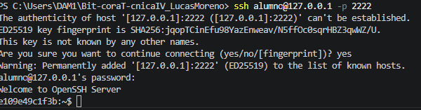

# Bit-coraT-cnicaIV_LucasMoreno
Al tener el servidor configurado, debemos ir a la taerminal de vs y escribir ssh alumno@localhost -p 2222. 
Problema 1: ssh alumno@localhost -p 2222 este no funciona debes escribir localhost@127.0.0.1

